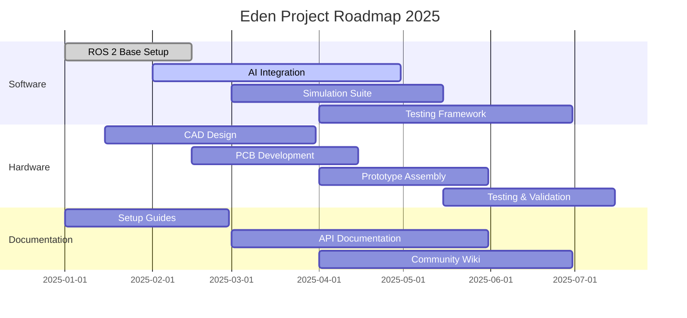

# 🌱 Eden HQ

> The central coordination hub for the Eden robotics project under the Turtle initiative

## 🚀 **NEW TO SOFTWARE? START HERE!**

### **📖 Complete Beginner's Guide**
**[Click here for the super simple step-by-step guide → GETTING_STARTED.md](GETTING_STARTED.md)**

### **📸 Visual Guide (With Pictures!)**
**[Click here for the visual step-by-step guide → VISUAL_GUIDE.md](VISUAL_GUIDE.md)**

### **⚡ Quick Actions (No coding needed!)**

#### **Update TODO List:**
1. **Click `TODO.md`** → **Click ✏️** → **Change `[ ]` to `[x]`** → **Click "Commit changes"** → **Done!**

#### **Add Roadmap Task:**
1. **Click `ROADMAP.md`** → **Click ✏️** → **Add new line** → **Click "Commit changes"** → **Done!**

### **🎯 That's it! No coding experience needed!** 🎉

---

## 🤖 Mission Statement

Eden is an ambitious robotics project that combines cutting-edge software, innovative hardware design, and artificial intelligence to create autonomous robotic systems. Our mission is to push the boundaries of what's possible in robotics through:

- **Software Excellence**: ROS 2-based architecture with AI/ML integration
- **Hardware Innovation**: Custom PCB design and 3D-printed components
- **Community-Driven**: Open-source development with comprehensive documentation

## 📁 Repository Directory

Eden is organized across multiple specialized repositories:

| Repository | Purpose | Status |
|------------|---------|--------|
| [eden-core](https://github.com/EDEN-robotics/eden-core) | 🤖 Shared software libraries | ✅ Complete |
| [eden-hardware-core](https://github.com/EDEN-robotics/eden-hardware-core) | ⚡ Shared CAD/electronics | ✅ Complete |
| [eden-adam-software](https://github.com/EDEN-robotics/eden-adam-software) | 🤖 Adam's RL + personality | ✅ Complete |
| [eden-adam-hardware](https://github.com/EDEN-robotics/eden-adam-hardware) | ⚡ Adam's unique CAD | ✅ Complete |
| [eden-eve-software](https://github.com/EDEN-robotics/eden-eve-software) | 🤖 Eve's RL + personality | ✅ Complete |
| [eden-eve-hardware](https://github.com/EDEN-robotics/eden-eve-hardware) | ⚡ Eve's unique CAD | ✅ Complete |

## 🖥️ Meeting Notes App

**NEW!** AI-powered meeting notes application with Word-like interface:

- **📝 Word-like GUI**: Familiar text editing experience
- **🤖 AI Integration**: Uses Google Gemini AI for formatting and enhancement
- **📄 Markdown Export**: Convert notes to GitHub-ready documentation
- **✨ Smart Features**: Auto-formatting, summaries, action item extraction

### Quick Start:
```bash
cd meeting-notes-app
copy env.template .env
# Add your Gemini API key to .env
python app.py
```

[📖 Full Documentation → meeting-notes-app/README.md](meeting-notes-app/README.md)

## 🗓️ Roadmap Preview

<details>
<summary>📊 Click to view current roadmap</summary>



</details>

## 🛠️ How to Use This Repository

### 🌐 **EASIEST WAY: Edit Directly on GitHub Website**

#### 📋 Updating TODO Lists (Super Easy!)
1. **Go to GitHub.com** and open this repository
2. **Click on `TODO.md`** file
3. **Click the pencil icon** ✏️ (top right) to edit
4. **Mark items complete**: Change `[ ]` to `[x]`
5. **Add new items**: Use `- [ ] Your new task here`
6. **Scroll down** and click **"Commit changes"**
7. **Type a message** like "Updated TODO list"
8. **Click "Commit changes"** - Done! ✅

#### 📊 Updating the Roadmap (Also Super Easy!)
1. **Go to GitHub.com** and open this repository
2. **Click on `ROADMAP.md`** file
3. **Click the pencil icon** ✏️ to edit
4. **Find the Mermaid code block** (starts with ```mermaid)
5. **Add new tasks**: Copy this format:
   ```
   Your Task Name        :active, task-id, 2025-03-01, 2025-04-30
   ```
6. **Change status**: `done`, `active`, `crit`, or custom
7. **Scroll down** and click **"Commit changes"**
8. **Type a message** like "Updated roadmap"
9. **Click "Commit changes"** - Done! ✅

### 🎯 **Step-by-Step Examples**

#### Example 1: Mark a TODO item as complete
```
# Before (in TODO.md)
- [ ] Set up ROS 2 Humble workspace

# After (change to this)
- [x] Set up ROS 2 Humble workspace
```

#### Example 2: Add a new roadmap task
```
# In ROADMAP.md, find a section like "Software Development" and add:
    New Feature Development  :active, new-feat, 2025-03-15, 2025-05-15
```

### 🚀 **For Advanced Users (Optional)**
```bash
# If you want to edit locally on your computer
git clone https://github.com/eden-org/eden-hq.git
cd eden-hq
# Edit files in your favorite editor
git add .
git commit -m "Update project status"
git push origin main
```

## ✅ To-Do List Preview

<details>
<summary>📋 Click to view high-level tasks</summary>

### 🤖 Software Tasks
- [ ] ROS 2 workspace setup and configuration
- [ ] Core navigation and control packages
- [ ] AI/ML integration for decision making
- [ ] Simulation environment setup
- [ ] Unit and integration testing framework

### ⚡ Hardware Tasks
- [ ] Mechanical design in SolidWorks
- [ ] PCB schematic and layout design
- [ ] Component sourcing and procurement
- [ ] Prototype assembly and testing
- [ ] Manufacturing documentation

### 📚 General Tasks
- [ ] Project documentation structure
- [ ] Community guidelines and contribution docs
- [ ] Website and landing page
- [ ] CI/CD pipeline setup
- [ ] Release management process

</details>

## 🔧 Development Workflow

### Getting Started
```bash
# Clone the repository
git clone https://github.com/eden-org/eden-hq.git
cd eden-hq

# Make your changes to TODO.md or ROADMAP.md
# Edit files in your preferred editor

# Commit and push changes
git add .
git commit -m "Update project status"
git push origin main
```

### Daily Workflow
1. **Check current status**: Open `TODO.md` to see what needs doing
2. **Update progress**: Mark completed items with `[x]`
3. **Add new tasks**: Use `- [ ] New task description` format
4. **Update roadmap**: Edit dates/status in `ROADMAP.md`
5. **Commit changes**: `git add . && git commit -m "Daily update"`

## 🤝 Contributing & Community

We welcome contributions from developers, engineers, and robotics enthusiasts! 

- **Getting Started**: Check out our [Contributing Guidelines](CONTRIBUTING.md)
- **Issues & Discussions**: Use GitHub Issues for bug reports and feature requests
- **Documentation**: Visit [eden-docs](https://github.com/eden-org/eden-docs) for detailed guides
- **Community**: Join our discussions and share your ideas!

## 📊 Project Status


---

*This repository serves as the central coordination hub for the Eden project. For source code, visit the specialized repositories listed above.*
