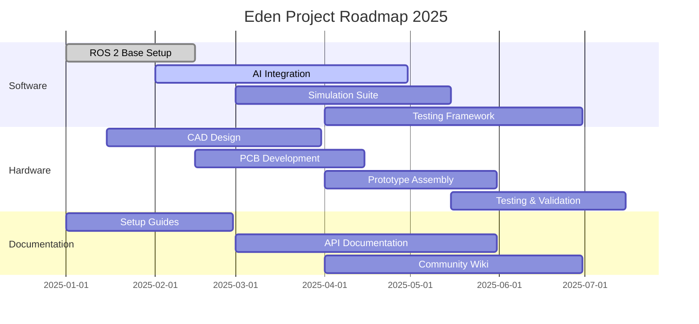

# 🌱 Eden HQ

> The central coordination hub for the Eden robotics project under the Turtle initiative

## 🤖 Mission Statement

Eden is an ambitious robotics project that combines cutting-edge software, innovative hardware design, and artificial intelligence to create autonomous robotic systems. Our mission is to push the boundaries of what's possible in robotics through:

- **Software Excellence**: ROS 2-based architecture with AI/ML integration
- **Hardware Innovation**: Custom PCB design and 3D-printed components
- **Community-Driven**: Open-source development with comprehensive documentation

## 📁 Repository Directory

Eden is organized across multiple specialized repositories:

| Repository | Purpose | Status |
|------------|---------|--------|
| [eden-software](https://github.com/eden-org/eden-software) | 🤖 Core software, ROS 2 packages, AI integration | 🚧 Active Development |
| [eden-hardware](https://github.com/eden-org/eden-hardware) | ⚡ CAD designs, PCB schematics, assembly guides | 🚧 Active Development |
| [eden-docs](https://github.com/eden-org/eden-docs) | 📚 Documentation, tutorials, community wiki | 🚧 Active Development |

## 🗓️ Roadmap Preview

📊 Click to view current roadmap

## ✅ To-Do List Preview

📋 Click to view high-level tasks

### 🤖 Software Tasks
- [ ] ROS 2 workspace setup and configuration
- [ ] Core navigation and control packages
- [ ] AI/ML integration for decision making
- [ ] Simulation environment setup
- [ ] Unit and integration testing framework

### ⚡ Hardware Tasks
- [ ] Mechanical design in SolidWorks
- [ ] PCB schematic and layout design
- [ ] Component sourcing and procurement
- [ ] Prototype assembly and testing
- [ ] Manufacturing documentation

### 📚 General Tasks
- [ ] Project documentation structure
- [ ] Community guidelines and contribution docs
- [ ] Website and landing page
- [ ] CI/CD pipeline setup
- [ ] Release management process

## 🤝 Contributing & Community

We welcome contributions from developers, engineers, and robotics enthusiasts! 

- **Getting Started**: Check out our [Contributing Guidelines](CONTRIBUTING.md)
- **Issues & Discussions**: Use GitHub Issues for bug reports and feature requests
- **Documentation**: Visit [eden-docs](https://github.com/eden-org/eden-docs) for detailed guides
- **Community**: Join our discussions and share your ideas!

## 📊 Project Status

---

*This repository serves as the central coordination hub for the Eden project. For source code, visit the specialized repositories listed above.*
