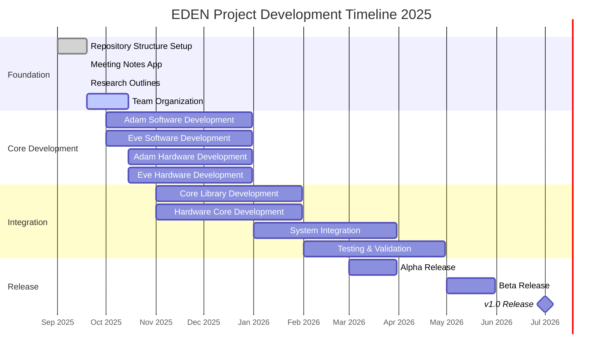

# 🗓️ Eden Project Roadmap

> Development timeline for the EDEN robotics project

## 📊 Master Gantt Chart



## 🛠️ How to Update This Roadmap

### Adding New Tasks
1. **Edit ROADMAP.md** and find the Mermaid code block
2. **Add new line** in the appropriate section:
   ```markdown
   Your New Task        :status, task-id, start-date, end-date
   ```
3. **Status options**: `done`, `active`, `crit` (critical), or custom
4. **Test your changes**: Use [Mermaid Live Editor](https://mermaid.live)

### Updating Task Status
```markdown
# Mark as completed
Repository Structure Setup    :done, repos, 2025-09-01, 2025-09-19

# Mark as critical
Adam Software Development   :crit, adam-sw, 2025-10-01, 2025-12-31

# Mark as active
Team Organization           :active, team-org, 2025-09-19, 2025-10-15
```

## 🎯 Phase Breakdown

### Phase 1: Foundation (September 2025)
- **Repository Structure** ✅
  - Core repositories established
  - Robot-specific repositories created
  - Meeting notes app deployed
  - Research outlines completed

### Phase 2: Core Development (October - December 2025)
- **Adam Development**
  - ROS 2 workspace setup
  - Navigation algorithms
  - Personality system
  - Reinforcement learning

- **Eve Development**
  - Computer vision pipeline
  - Natural language processing
  - Personality system
  - Learning mechanisms

### Phase 3: Hardware Development (October - December 2025)
- **Adam Hardware**
  - Mechanical design
  - PCB development
  - Component selection
  - Assembly guides

- **Eve Hardware**
  - Mechanical design
  - PCB development
  - Component selection
  - Assembly guides

### Phase 4: Integration (January - April 2026)
- **Core Libraries**
  - Shared software components
  - Hardware abstraction layers
  - System integration
  - Testing and validation

### Phase 5: Release (March - July 2026)
- **Alpha Release**: Core functionality
- **Beta Release**: Feature complete
- **v1.0 Release**: Production ready

## 🚀 Key Milestones

| Date | Milestone | Description |
|------|-----------|-------------|
| 2025-09-19 | Foundation Complete | Repository structure and tools setup |
| 2025-10-15 | Team Organization | Development teams established |
| 2025-12-31 | Core Development | Adam and Eve basic functionality |
| 2026-03-31 | Alpha Release | Working prototypes |
| 2026-05-31 | Beta Release | Feature complete systems |
| 2026-07-01 | v1.0 Release | Production ready release |

---

*This roadmap is updated weekly during team meetings. For detailed task tracking, see [TODO.md](TODO.md) and meeting notes in the `meeting-notes/` folder.*
