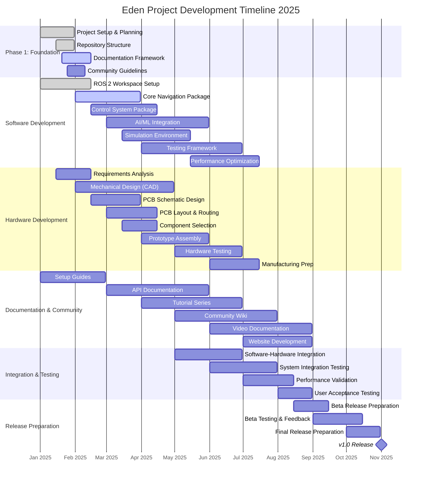

# 🗓️ Eden Project Roadmap

> Comprehensive development timeline for the Eden robotics project

## 📊 Master Gantt Chart

## 🎯 Phase Breakdown

### Phase 1: Foundation (January 2025)
- **Project Setup & Planning** ✅
  - Repository structure established
  - Development workflow defined
  - Community guidelines created

### Phase 2: Core Development (February - April 2025)
- **Software Foundation**
  - ROS 2 workspace configuration
  - Core navigation and control packages
  - Basic AI/ML integration framework

- **Hardware Foundation**
  - Mechanical design in SolidWorks
  - PCB schematic development
  - Component selection and sourcing

### Phase 3: Integration & Testing (May - July 2025)
- **System Integration**
  - Software-hardware integration
  - Simulation environment setup
  - Comprehensive testing framework

- **Documentation**
  - API documentation
  - Tutorial series
  - Community wiki

### Phase 4: Release Preparation (August - November 2025)
- **Beta Release**
  - Beta testing program
  - Performance optimization
  - User feedback integration

- **Final Release**
  - v1.0 release preparation
  - Launch documentation
  - Community celebration! 🎉

## 🔗 Dependencies

### Critical Path Dependencies
1. **Hardware → Software**: PCB design must be finalized before software integration
2. **Documentation → Community**: Setup guides must be complete before community onboarding
3. **Testing → Release**: All testing phases must pass before beta release

### Cross-Repository Dependencies
- `eden-software` depends on `eden-hardware` for hardware interface specifications
- `eden-docs` depends on both software and hardware repositories for content
- All repositories depend on `eden-hq` for coordination and project management

## 📈 Success Metrics

### Technical Metrics
- [ ] 95%+ test coverage across all software packages
- [ ] <100ms response time for critical control loops
- [ ] 99.9% uptime in simulation environment
- [ ] All hardware components pass stress testing

### Community Metrics
- [ ] 50+ active contributors across all repositories
- [ ] 100+ GitHub stars across the organization
- [ ] 20+ community-contributed features
- [ ] 10+ external projects using Eden components

## 🚀 Milestones

| Date | Milestone | Description |
|------|-----------|-------------|
| 2025-02-28 | Foundation Complete | All repositories set up with basic structure |
| 2025-04-30 | Alpha Release | Core functionality working in simulation |
| 2025-07-31 | Beta Release | Hardware-software integration complete |
| 2025-11-01 | v1.0 Release | Full production-ready release |

---

*This roadmap is a living document and will be updated as the project evolves. For the most current status, check our [GitHub Issues](https://github.com/eden-org/eden-hq/issues) and [Project Boards](https://github.com/orgs/eden-org/projects).*
